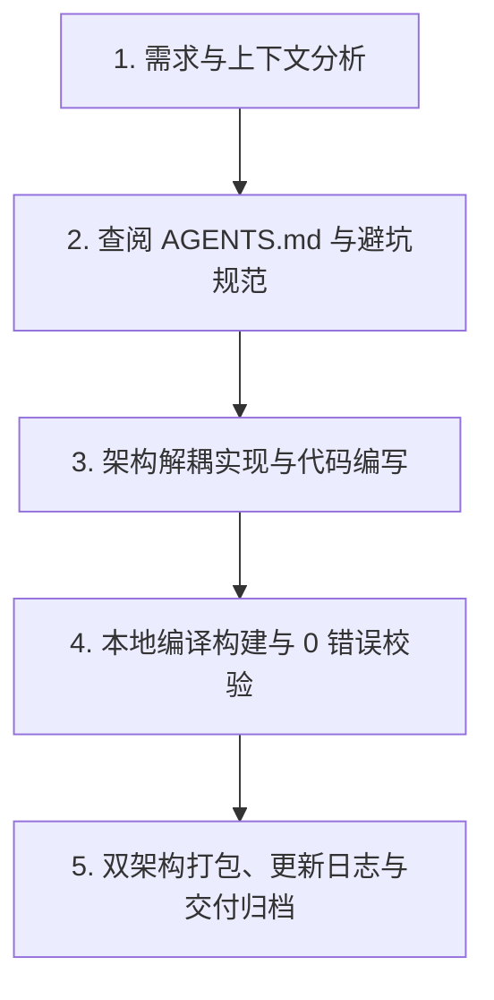

# StarPie (星盘) - 核心架构与多轮开发继承规范 (AGENTS.md)

> **致未来的 AI Agent 与开发者**：  
> 本文档是 **StarPie (原 WinPieGestures)** 项目的唯一权威工程架构与协作规范指南。当你在新的对话轮次或全新环境中接手本项目时，**必须首先通读本文档**，严格遵循本规范中所确立的架构分层、设计哲学、避坑指南与发布工作流，确保项目在持续迭代中保持高内聚、高品质、零退化与丝滑流畅。

---

## 目录
1. [🌟 项目起源、使命与设计哲学](#1-项目起源使命与设计哲学)
2. [🏗️ 源码架构与核心模块分工](#2-源码架构与核心模块分工)
3. [⚙️ 核心技术机制与避坑规范](#3-核心技术机制与避坑规范)
4. [🔄 代码生成、编译与发布流水线](#4-代码生成编译与发布流水线)
5. [🎨 UI/UX 与视觉设计规范](#5-uiux-与视觉设计规范)
6. [📜 版本演进与发布记录](CHANGELOG.md)
7. [🤝 Agent 接力协作与交付验收闭环](#7-agent-接力协作与交付验收闭环)

---

## 1. 🌟 项目起源、使命与设计哲学

### 1.1 灵感来源与初衷
- **创作者背景**：机械设计制造及其自动化专业学生，深度使用工业 CAD 软件 **SolidWorks**。
- **灵感核心**：SolidWorks 内置的**鼠标笔势手势轮盘 (Mouse Gestures Wheel)** 能在三维建模中带来行云流水般的盲操提效体验。本项目旨在将这种**工业级的高效轮盘交互迁移至 Windows 桌面全局**，使所有用户在日常办公、代码编写、设计创作与游戏多任务中，均能享受指尖翻飞的极速操作。
- **开源仓库**：GitHub `SoftBlack42/StarPie`。

### 1.2 产品三大工程红线 (Core Non-Negotiables)
1. **极致轻量与低内存驻留 (Ultra-Lightweight & Efficient Working Set)**：
   - **分态务实内存基准**（基于原生 .NET 8 WPF + Win32 真实运行时物理工作集）：
     - **静默后台守护态**（仅托盘与全局底层钩子常驻，控制台未打开）：物理内存平稳驻留于 **15MB ~ 30MB**（系统深睡整理后约 **10MB ~ 20MB**），远优于 Electron 框架应用（普遍 150MB ~ 300MB+）；
     - **轮盘唤出与手势交互态**（DirectX 硬件加速透明渲染、瞬时视觉树与图标缓存）：峰值控制在 **25MB ~ 50MB**，确保热代码常驻物理 RAM，绝不因硬缺页引发掉帧卡顿；
     - **控制台全量 UI 开启态**（4 标签页、实时交互 Canvas、复杂控件树与应用搜索）：控制在 **60MB ~ 110MB**，窗口关闭 30 秒按需释放后平稳回落至后台驻留态；
   - 杜绝引入重量级第三方 UI 库（如 Electron、MAUI、Heavy Chromium），纯基于原生 **.NET 8 WPF + Win32 P/Invoke API** 深度调优；
   - 绘图画刷、笔刷必须显式调用 `Freezable.Freeze()` 消除内存泄漏与 GC 抖动；严禁在常驻数据模型或 `config.json` 中塞入巨型 Base64 字符串，防止 .NET 大对象堆 (LOH) 碎片化导致工作集异常膨胀。
2. **零延迟与极致丝滑 (Zero Latency & 60/120 FPS Fluidity)**：
   - 鼠标右键/中键/侧键按下到轮盘完全呈现场景延迟必须 **< 16ms**；
   - 扇区高亮动画与光晕过渡采用贝塞尔平滑插值，杜绝卡顿与掉帧；
   - 钩子回调线程内绝不执行耗时 IO 或复杂计算，纯轻量位运算捕获。
3. **肌肉记忆与确定性 (Muscle Memory & Reliability)**：
   - 扇区角度与操作严格绑定空间极坐标方向（4 字键、8 字键、12 字键预设档，均为 360°/N 等分且第 0 位固定正东）；
   - 盲操触发命中率 100%，杜绝误触、漂移与错选。

---

## 2. 🏗️ 源码架构与核心模块分工

### 2.1 目录结构全景
```text
g:\Users\2 Better\Desktop\design\
├── WinPieGestures/                # 主工程源码目录 (.NET 8.0 WPF)
│   ├── WinPieGestures.csproj      # 项目配置文件 (版本号、依赖与打包参数)
│   ├── App.xaml / App.xaml.cs     # 应用宿主、单例互斥锁、Hook/托盘/设置窗口生命周期
│   ├── TrayController.cs          # 进程级系统托盘控制器（菜单、主题、UIPI 防护、提示与退出）
│   ├── RadialWindow.xaml(.cs)     # 核心悬浮轮盘窗口 (硬件加速透明渲染、高频动画)
│   ├── SettingsWindow.xaml(.cs)   # 按需创建的控制台主界面（配置面板、实时交互画布）
│   ├── SubActionEditorWindow.xaml(.cs) # 二级级联子动作独立编辑器
│   ├── HotkeyBuilderDialog.xaml(.cs)   # 快捷键拼装组合器 (自包含样式、一键预设芯片)
│   ├── ColorPickerWindow.xaml(.cs)     # 颜色选择器 (色盘选择、色相环与屏幕实时吸色)
│   ├── IconPickerWindow.xaml(.cs)      # 内置矢量 SVG / 图标提取器
│   ├── ProgramPickerWindow.xaml(.cs)   # 软件检索器 (模糊搜索、拼音索引、MRU缓存)
│   ├── InputDialog.xaml(.cs)      # 通用文本输入与配置重命名弹窗
│   ├── GestureController.cs       # 手势状态机 (拖拽位移、极坐标计算、命中测试)
│   ├── MouseHook.cs               # 低级鼠标全局钩子 (WH_MOUSE_LL)
│   ├── KeyboardHook.cs            # 低级键盘全局钩子 (WH_KEYBOARD_LL)
│   ├── ActionExecutor.cs          # 动作调度与 Win32 SendInput 模拟执行引擎
│   ├── ConfigManager.cs           # 配置序列化、持久化、导入/导出与注册表自启管理
│   ├── AppConfig.cs               # 全局配置数据模型 (主题、尺寸、动作、白名单等)
│   ├── WheelProfile.cs            # 单个轮盘方案数据模型 (扇区数、动作槽位列表)
│   ├── CustomColorPreset.cs       # 自定义配色方案模型
│   ├── AppThemeManager.cs         # 窗口深浅色主题画刷注入管理器
│   ├── FullScreenHelper.cs        # 独占全屏检测与 Windows Explorer 穿透识别
│   ├── ActiveWindowHelper.cs      # 前台活动窗口探测器
│   ├── MemoryOptimizer.cs         # 内存整理与工作集压缩工具
│   ├── I18n.cs                    # 多语言国际化字典 (zh-CN, zh-TW, en-US, ja-JP)
│   ├── Renderers/                 # 轮盘切削形态渲染器策略族
│   │   ├── IRadialStyleRenderer.cs    # 渲染器通用抽象接口
│   │   ├── BaseStyleRenderer.cs       # 几何切削基础类
│   │   ├── StyleRendererFactory.cs    # 渲染器工厂
│   │   ├── ClassicRingRenderer.cs     # 经典圆弧与圆角胶囊渲染器
│   │   ├── CleanSectorsRenderer.cs    # 悬浮圆角矩形渲染器
│   │   └── GlassmorphismRenderer.cs   # 液态毛玻璃渲染器
│   └── Plugin/                    # ★ 插件系统宿主实现（详见 3.7）
│       ├── PluginHost.cs              # 执行/校验/安装的唯一入口接缝
│       ├── PluginCatalog.cs           # 贡献点注册表 + 注册会话（暂存→提交的原子性）
│       ├── PluginLoadContext.cs       # 可回收 ALC（停用即卸载，需重启比例是硬指标）
│       ├── PluginInstance.cs          # 单个插件的运行时状态机与加载计量
│       ├── PluginScanner.cs           # 纯静态 PE 识别（不加载程序集即可读清单与 TFM）
│       ├── PluginManifestReader.cs    # plugin.json / 程序集元数据双通道清单读取
│       ├── PluginInvoker.cs           # 动作调用与超时/取消/串行化调度
│       ├── PluginParameterValidator.cs # 声明式参数约束校验（Required/MaxLength/Min/Max/Regex）
│       ├── PluginParameterForm.cs     # 参数表单动态渲染（9 种 ParameterFieldType）
│       ├── PluginActionBinding.cs     # 「Type + PluginActionRef ⇄ 单 Tag」双向投影
│       ├── PluginI18n.cs              # 插件词条 key 的统一解析（短键 ⇄ 全键）
│       ├── PluginListItem.cs          # 插件管理页的列表项 DTO
│       ├── PluginSelfTest.cs          # --plugin-selftest 无界面端到端自检通道
│       ├── PluginSettings.cs          # 插件私有持久化（settings.json）
│       ├── PluginPaths.cs             # 插件目录/清单/日志/便携模式判定
│       ├── PluginRegistryStore.cs     # 启用状态与哈希登记（registry.json）
│       ├── PluginLogger.cs            # 按插件分文件的日志
│       ├── PluginContext.cs           # IPluginContext 实现 + 能力门禁 + 词条注册表
│       └── PluginHostServices.cs      # 动作执行/窗口/剪贴板/通知等宿主服务实现
├── StarPie.Plugin.Abstractions/   # ★ 插件 SDK 契约层（插件唯一允许引用的 StarPie 程序集）
│   ├── IStarPiePlugin.cs          # 插件入口契约（Initialize / Shutdown）
│   ├── IPluginContext.cs          # 插件可见的宿主能力集合
│   ├── Actions.cs                 # ActionDescriptor / ParameterField / ActionResult
│   ├── Registries.cs              # 动作、图标、词条注册表契约
│   ├── Services.cs                # 宿主服务契约（窗口、剪贴板、通知、事件）
│   ├── PluginManifest.cs          # plugin.json 清单模型
│   ├── PluginMetadata.cs          # 程序集元数据兜底模型
│   └── PluginApi.cs               # 契约常量（ApiVersion / 前缀 / 上限）
├── samples/                       # ★ 社区插件示例（可直接构建为可分发的插件目录）
│   ├── HelloAction/               # 参考模板，演示 SDK 全部可做之事（Text/Bool/Enum/Folder 参数）
│   └── ScreenBrightness/          # 压力测试样本：P/Invoke + COM 互操作 + 耗时 IO（Number/Bool 参数）
├── releases/                      # 正式发行包构建归档目录
│   └── vX.Y.Z/
│       ├── Lightweight/           # 依赖运行时的轻量绿色包 (~2.5MB)
│       ├── Standalone/            # 独立单文件免安装自解压包 (~65MB)
│       ├── StarPie-vX.Y.Z-Lightweight-win-x64.zip
│       └── StarPie-vX.Y.Z-Standalone-win-x64.zip
├── attachments/                   # 文档与演示动图素材库 (GIF / PNG)
├── scratch/                       # 代码反编译基线与代码生成流水线工具
│   ├── Decompiler/                # Program.cs 流水线生成器工程
│   └── v152_decompiled/           # 反编译基线源码
├── AGENTS.md                      # 本架构与继承开发规范
└── CHANGELOG.md                   # 完整版本演进与发布日志
```

---

## 3. ⚙️ 核心技术机制与避坑规范

### 3.1 极坐标分区与扇区命中测试 (Hit-Testing)
- **极坐标基准**：
  $$\theta = \text{atan2}(\Delta y, \Delta x) \in [-\pi, \pi]$$
  角度 $0$ 为右侧，$\pi/2$ 为正下方（WPF 坐标系 Y 轴向下）。
- **一级轮盘与外圈子环 (Outer Sub-Ring)**：
  根据扇区数量 $N \in \{4, 8, 12\}$ 均匀划分扇区角度 $\Delta \theta = 2\pi / N$，扇区中心角 $\theta_i = -\pi/2 + i \cdot \Delta \theta$。
- **蜂窝扇 (Honeycomb Fan)**：
  - 二级菜单以被选中的主扇区为圆心展开（最多 3 项）；
  - **命中判定算法**：**严禁使用欧几里得圆心欧氏距离判定**！必须采用极坐标夹角绝对距离最近邻划分：
    $$\text{TargetIndex} = \arg\min_j |\text{NormalizeAngle}(\theta_{\text{mouse}} - \theta_j)|$$
    使得光标向左划动时必然命中左侧子叶，向右划动时必然命中右侧子叶，彻底杜绝判定左右颠倒的缺陷。

### 3.2 Win32 `SendInput` 模拟与硬件扫描码注入
- **硬件扫描码映射 (Scan Code)**：
  Windows 部分应用（如 Photoshop、Illustrator、3D CAD 等）直接监听底层硬件扫描码而非虚拟键码。下发按键时必须使用 Win32 `MapVirtualKey(vk, MAPVK_VK_TO_VSC)` 转换扫描码，并为方向键、Delete、Insert、PageUp/Down、Home/End、Win 等键打上 `KEYEVENTF_EXTENDEDKEY` 标志。
- **修饰键时延保持 (Modifier Hold Delay)**：
  下发 `Ctrl + G` 或 `Ctrl + Shift + G` 等组合键时，必须在修饰键按下和主键按下之间保留 **10ms ~ 15ms** 保持时延，并在主键释放后再释放修饰键，避免宿主应用因时序竞争丢失修饰键而误判为单键 `G`。
- **连续数值与文本注入**：
  遇到多位数值（如 `"100"`、`"1920"`）或字符串时，采用 `KEYEVENTF_UNICODE` 字符流逐字符发送，完美规避输入法阻断。

### 3.3 快捷键录制框 (`HotkeyRecorderBox`) 焦点规范
- **禁止 WPF 默认焦点跳转**：
  `Tab` 是 WPF 系统的焦点切换键。在 `HotkeyRecorderBox` 控件中必须在构造函数中执行：
  ```csharp
  KeyboardNavigation.SetTabNavigation(this, KeyboardNavigationMode.None);
  KeyboardNavigation.SetDirectionalNavigation(this, KeyboardNavigationMode.None);
  KeyboardNavigation.SetControlTabNavigation(this, KeyboardNavigationMode.None);
  ```
  确保按下 `Tab`、`Alt + Tab`、`Win + Tab` 时控件不丢失焦点，并能在 `OnPreviewKeyDown` 中拦截 `Key.Tab` / `Key.System` 顺利完成组合录制。

### 3.4 场景隔离、全屏检测与白名单穿透
- **Windows Explorer 进程穿透**：
  桌面窗口（`Progman`、`WorkerW`、`SHELLDLL_DefView`、`SysListView32`）与任务栏（`Shell_TrayWnd`、`Shell_SecondaryTrayWnd`）在全屏检测中必须显式穿透，不得被判定为全屏独占应用。
- **白名单优先级**：
  在「全屏游戏/独占应用自动禁用手势」开启时，位于 `WhitelistedProcesses` 白名单中的程序（如 Photoshop、CAD、Visual Studio 等）具有**最高旁路优先级**，无论是否全屏独占均能呼出轮盘。

### 3.5 配置持久化与自定义配色无损导入/导出
- **数据完整性**：
  `ConfigManager.ExportConfig` 必须将全局 `CustomColorPresets` 列表连同当前主题选择、微调色彩参数、几何尺寸全部导出至 JSON。
- **导入即时刷新**：
  `ImportConfigButton_Click` 导入成功后，必须立即调用：
  ```csharp
  ReloadThemePresets(); // 重构一二级主题下拉列表
  RefreshSlots();       // 刷新动作列表绑定
  RenderLiveWheelPreview(); // 刷新实时交互画布
  ```
  杜绝由于 `_isUpdatingUi` 状态锁导致界面控件脱节的问题。

### 3.6 应用宿主、托盘与设置窗口生命周期
- **进程级所有权**：`App` 是程序宿主，负责持有 `MouseHook`、`KeyboardHook`、`GestureController`、`TrayController`，并通过 `ShowSettingsWindow(int tabIndex = -1)` 统一管理 `SettingsWindow` 的创建与显示。
- **托盘必须独立于设置窗口**：
  - `NotifyIcon`、托盘菜单、暂停/恢复、主题、本地化、提权、退出和提示气泡统一由 `TrayController` 管理；
  - 管理员权限运行时的 `ChangeWindowMessageFilter` / `ChangeWindowMessageFilterEx` UIPI 消息放行必须保留在 `TrayController`；
  - 严禁重新把托盘生命周期放回 `SettingsWindow`，否则静默启动会再次加载完整控制台 UI。
- **设置窗口按需创建**：
  - 静默启动、开机自启时严禁直接 `new SettingsWindow()`；
  - 普通启动、托盘菜单、第二实例唤醒，以及轮盘动作「打开 StarPie 控制台」都必须调用 `App.ShowSettingsWindow()`；
  - 严禁使用 `App.MainSettingsWindow?.ShowSettings()` 作为入口，因为窗口释放后该调用会静默失效。
- **30 秒延迟释放策略**：
  - 用户关闭控制台时先 `Hide()` 并启动 30 秒一次性计时器；
  - 30 秒内重新打开时取消计时器并复用原窗口；
  - 空闲超过 30 秒后才真正 `Close()`，解除外部事件、停止计时器、取消下载/更新任务并释放 ViewModel；
  - 最终释放后只允许调用 `MemoryOptimizer.TrimMemory(force: false)`，不得在日常关闭路径执行 Full GC 与强制工作集剥离，避免下一次轮盘唤起发生硬缺页或卡顿。
- **初始化不得产生系统副作用**：WPF 给 `CheckBox.IsChecked` 赋值时也可能触发 `Checked/Unchecked`。加载自启动状态时必须同时使用 `_isUpdatingUi`、`_isUiInitializing` 与 `_isLoadingAutoStartState` 防护，并比较已加载状态；只有用户实际修改开关时才能调用 `ConfigManager.SetAutoStart()`，严禁打开控制台时创建或删除计划任务。
- **显式退出模式**：`App.xaml` 必须保持 `ShutdownMode="OnExplicitShutdown"`，关闭最后一个设置窗口不能结束后台 Hook 与托盘进程；只有托盘退出、提权重启或明确的应用退出流程可以调用 `Shutdown()`。

### 3.7 插件系统 (`StarPie.Plugin.Abstractions` + `WinPieGestures/Plugin/`)
- **三层分界，任何一层都不许越界**：
  - **SDK 契约层** `StarPie.Plugin.Abstractions/`（独立程序集，插件唯一允许引用的 StarPie 程序集）。改动它等于改公共契约，只增不改；
  - **宿主实现层** `WinPieGestures/Plugin/`（`PluginHost` 是主程序唯一的调用接缝）；
  - **示例层** `samples/`（`HelloAction` 是社区参考模板，`ScreenBrightness` 是 P/Invoke + COM + 耗时 IO 的压力测试样本）。
- **插件工程的四条硬约束**（改错任一条都会导致加载失败或类型身份分裂）：
  1. `TargetFramework` 不得高于宿主（`net8.0-windows` / `net8.0-windows10.0.19041.0`），宿主直接读 `TargetFrameworkAttribute` 核对；
  2. `ProjectReference` 必须带 `<Private>false</Private>`，否则产物里会多出一份 `StarPie.Plugin.Abstractions.dll`，出现两份 `IStarPiePlugin` 类型身份，强转全部失败；
  3. 只允许引用 SDK 与 BCL，**严禁引用主程序 `StarPie.dll`**；
  4. **零 NuGet 依赖**（项目内存红线的一部分，也是「插件不得成为新的依赖黑洞」的保证）。
- **注册会话的原子性**：插件在 `Initialize` 期间的一切注册（动作、图标、词条）都只是**暂存**，必须等 `Initialize` 成功返回后才由 `PluginCatalog.Commit` 一次性落表。失败则 `Discard`，绝不留下半套贡献点。
- **⚠️ 词条时序坑（易复发）**：显示名解析发生在 `Actions.Register` 的当时，而词条要等 `Commit` 才写进 `I18n`。若只在注册当时解析，带 `DisplayNameKey` 的动作会**全部落空并静默退回字面文案** —— 而字面文案与译文常常一模一样，所以这个缺陷在中文环境下不露面，等用户切成英文才发现。修法是 `Commit` 落完词条后调用 `ResolveStagedDisplayNames` 补解析一次。**不要**改成「让解析去读暂存表」，那会要求插件遵守「词条必须写在动作之前」这种没人记得的顺序约定。
- **参数契约 = 声明式，插件不提供 XAML**：
  - 插件只声明 `ParameterField`（9 种类型：`Text` / `MultilineText` / `Number` / `Bool` / `Folder` / `File` / `Enum` / `Hotkey` / `Color`），控件由 `PluginParameterForm` 用主程序的隐式样式创建 —— 深浅色、字体、圆角因此由宿主统一保证，主程序改版也不会让插件界面错位；
  - **两层校验，同一入口**：`PluginHost.ValidateActionParameters` 先跑宿主底线 `PluginParameterValidator`（只认 `Required` / `MaxLength` / `Min` / `Max` / `ValidationRegex` 声明，不依赖插件是否记得自查），再跑插件自定义 `IActionContribution.Validate`。**「保存动作」与「执行前」必须都走这一个方法**，否则迟早分叉成「存的时候没事、一触发说参数不合法」。
  - `Bool` 字段未填视为 `false`，**不算必填失败**，也不要「空值即删除」——取消勾选必须显式落盘 `false`，否则插件读到的会是它自己的兜底值（可能为 `true`），表现为「取消勾选没生效」。
  - 数值参数一律用 `InvariantCulture` 读写（宿主侧与 `PluginActionInput.Int/Double` 都是），否则德法等以逗号作小数点的区域会把 `0.5` 解析失败并静默退回默认值。
- **动作调度类别 `ActionKind`**：`Sequential` 占用唯一的动作线程，**任何可能上百毫秒的操作（DDC/CI、网络、目录遍历）都必须声明为 `Background`**，否则用户会明显感到「触发后轮盘卡一下」，直接违背零延迟红线。
- **熔断与「伪失败」**：宿主对连续失败 5 次的动作会判定为插件缺陷并自动 `Quarantined`。因此**环境不具备条件不是插件失败**（如显示器未开启 DDC/CI），必须返回 `ActionResult.Ok(..., silent: false)` 并说明原因；返回 `Fail` 会让用户连点几次就把一个正常插件弄成「已隔离」。
- **界面接缝：动作类型下拉「收敛成一个类型 + 一个子下拉」**：插件动作在数据模型上仍是 `ActionItem.Type = "Plugin"` + `PluginActionRef`（`PluginId` + `ContributionId` + `FullId`），但界面上**类型下拉只承载一个选项**「插件动作」，具体是哪个动作由紧随其后的子下拉决定。因此：
  - 类型下拉的 `Tag` 就是**裸 `Plugin`**，不需要也不应该编码身份（历史上有过 `Plugin:<贡献点全ID>` 的编码与配套的 `TryParseTag`/`ProjectTag` 退化逻辑，收敛后全部成了死代码，已删除）；
  - 子下拉用 `ListCollectionView` + `PropertyGroupDescription(GroupName)` 按插件名分组，分组头不是 `ComboBoxItem`，**天然不可选中** —— 从结构上排除「选中了插件名却不是一个动作」这种非法状态；
  - **`PluginActionOptions` 每次求值都新建视图**，所以它只能在**类型切换**时通知重建（`Type` / `AggregatedType` 的 setter），**绝不能**纳入 `NotifyAllPropertiesChanged`：否则任何无关属性变更都会重建视图，而 `ItemsSource` 一变 `ComboBox` 就会把 `SelectedValue` 置空，用户配好的动作会被静默清掉。同理 `SelectedPluginActionFullId` 的 setter 要**忽略空值写入**；
  - **切换类型时不要清空插件引用**：来回切一次类型就把配置弄丢，是最容易被当成「软件有 bug」的行为。
  - 分组名必须**按插件去重统计**重名：直接对注册动作逐个取名，一个有 9 个动作的插件会被数成 9 次，「重名」于是永远成立，组标题会莫名其妙拖上一串插件 ID。
- **图标 key 前缀**：插件图标形如 `plugin:<pluginId>:<shortKey>`，由 `IconHelper.GetSvgPathByKey` 在 `IconMap` 命中之后、裸 path 判定之前解析。插件 SVG 必须用最朴素的 `M/A/L/H/V/Z` 构造 —— 语法一错会让轮盘几何解析抛异常，收益远小于风险。
- **两个插件目录，职责严格分开（改动路径逻辑前必读）**：
  - **只读扫描目录** `程序目录\plugin\`（`PluginPaths.ScanRoot`）：随发行包分发的**待安装候选**。只放 `.dll`，不递归子目录。宿主对这里**只读** —— **绝不创建、绝不写入、绝不删除**，`EnsureDirectories()` 也不例外。程序可能装在 Program Files，`ScanRoot` 不存在时唯一正确的动作是「什么都不做」。
  - **可写宿主区** `%LOCALAPPDATA%\StarPie\plugin-data\`（`PluginPaths.Root`）：安装副本、`registry.json`、`health.json`、插件私有 `data\` 全在这里。宿主拥有整棵目录，卸载时可以安全删。
  - 便携模式（`portable.flag` / `PortableMode`）**只改可写宿主区的落点**（挪到程序目录下的 `plugin-data\`），`ScanRoot` 永远固定在程序目录。
  - 历史上可写宿主区叫 `plugins\`。**只改目录常量而不搬迁 `registry.json` 会静默丢数据**：启用状态、已确认能力、入口哈希全在里面。`PluginPaths.Configure` 里保留了 `MigrateLegacyHostRoot`，`Move` 失败（被占用/跨卷）时退化为复制。
- **候选安装的三条规则**：
  1. 扫描目录里的 `.dll` **只登记为候选**，不进 `Instances`、不加载、不出现在插件列表 —— 装不装由用户点按钮决定。这与 `SyncFromDisk` 第 ② 段自动登记的「可写宿主区里带 `plugin.json` 的手工投放」是两回事：后者已经是安装产物；
  2. **复制策略由 `ManifestSource` 决定，不是由调用方决定**：有 `plugin.json`（`Manifest`）说明那个目录整体是一个插件包，整目录复制；只有裸 DLL（`AssemblyMetadata`）时 `SourceDirectory` 只表示「那枚 dll 碰巧躺在哪个目录」（可能就是「下载」文件夹或 `plugin\`），**只复制那一枚**。历史上无条件整目录复制，会出现「从下载文件夹装一枚 dll，把整个下载目录搬进插件目录」以及「只装了 A，邻居 B 也跟着出现」；
  3. 覆盖安装裸 DLL 前要**清掉上一次的载荷**（程序集与清单），否则目录里留下两枚业务 dll 会让「唯一业务 dll」的识别约定失效；但必须**保留 `data\` 与 `settings.json`** —— 更新一次版本不该清空用户数据。
- **`PluginInstance` 的两个目录属性不能混用**：`ManagedDirectory` 是宿主拥有的安装目录（删除/改名/写入只能用它）；`Directory` 仅供展示（外部路径登记时返回 `ExternalPath` **所在目录**）。历史上只有 `Directory` 一个属性，而外部登记分支返回的其实是**dll 文件路径**，当时只是靠 `Directory.Exists(文件路径)` 恒为 `false` 才「恰好」没把开发者的输出目录删掉。现在 `Uninstall` 走 `IsExternal` 分支：外部登记只摘登记、不碰磁盘。
- **`PluginHost.SyncFromDisk` 必须就地更新**：对已在内存的实例只能更新 `Entry`/`Scan`，**不得**无条件 `new PluginInstance` 替换字典条目，否则旧实例与其 `AssemblyLoadContext` 失去宿主引用形成**孤儿 ALC**（动作仍注册着，内存与文件锁都释放不掉）。进插件管理页就会触发与磁盘对账。
- **自检通道 `StarPie.exe --plugin-selftest <插件.dll> [报告路径] [--skip-invoke]`**：覆盖静态识别 → 安装 → 启用 → 词条命中率 → 声明式参数校验（含越界与正向用例）→ 动作选择器接缝 → 只读扫描目录与候选安装 → 真实调用 → 停用并核对 ALC 回收 → 卸载 → 环境还原。
  - **自检整体跑在临时沙箱里**：`PluginPaths.OverrideRootsForTesting` 会把两个根目录钉到 `%TEMP%\StarPie-PluginSelfTest-<随机>\`，跑完即删。**`Configure` 见到根目录已被钉住必须直接返回**，否则沙箱会被覆盖回真实目录，自检就成了「每跑一次回归就动一次用户已装插件」。
  - **附加 `--skip-invoke` 可跳过第 [4] 段真实调用**：那一节会真的下发键鼠/调节系统状态（实测会把屏幕亮度推高 10%）。日常只关心识别、注册与接缝结论的回归应带上这个开关。
  - 正向用例的基线**只能**照抄插件声明的 `DefaultValue`，缺默认值时必须跳过而不是自己编一个值 —— 编出来的值可能过不了插件的 `ValidationRegex`，让自检报出假失败；反之断言里若用「错误总数 > 0」也会在错误的原因下通过，必须断言「该字段名下确实出现错误」。

---

## 4. 🔄 代码生成、编译与发布流水线

### 4.1 代码构建与修改原则
- **优先直接维护 `WinPieGestures/` 源码**：项目源码已完整解耦，可以直接在 `WinPieGestures` 中进行修改、扩展与调试。
- **流水线工具 `scratch/Decompiler/Program.cs`**：当需要批量从基线生成或大范围重构时，同步维护 `Program.cs` 并通过 `dotnet run --project scratch/Decompiler` 生成源码。

### 4.2 标准构建与发布命令集
```powershell
# 1. 编译 Release 版本并校验 0 错误
dotnet build "g:\Users\2 Better\Desktop\design\WinPieGestures" -c Release

# 2. 发布轻量版 (Lightweight, 需本地 .NET 8 运行时, 体积 ~2.5MB)
dotnet publish "g:\Users\2 Better\Desktop\design\WinPieGestures" -c Release -r win-x64 --no-self-contained -o "g:\Users\2 Better\Desktop\design\releases\vX.Y.Z\Lightweight"

# 3. 发布独立免安装版 (Standalone, 自带运行时, 单文件绿色版, 体积 ~65MB)
dotnet publish "g:\Users\2 Better\Desktop\design\WinPieGestures" -c Release -r win-x64 --self-contained true -p:PublishSingleFile=true -p:IncludeNativeLibrariesForSelfExtract=true -o "g:\Users\2 Better\Desktop\design\releases\vX.Y.Z\Standalone"

# 4. 编译 Inno Setup 自动化安装包 (Setup.exe, 自包含 .NET 8 独立运行时, LZMA2 固实压缩, 体积 ~30MB)
# (需本地安装 Inno Setup 6, 或直接运行 powershell installer/build-installer.ps1)
& "C:\Program Files (x86)\Inno Setup 6\ISCC.exe" "/DMyAppVersion=X.Y.Z" "/DSourceDir=g:\Users\2 Better\Desktop\design\releases\vX.Y.Z\Standalone" "/DOutputDir=g:\Users\2 Better\Desktop\design\releases\vX.Y.Z" "/DOutputBaseFilename=StarPie-vX.Y.Z-Setup-win-x64" "g:\Users\2 Better\Desktop\design\installer\StarPie.iss"

# 5. 自动化打包生成 ZIP 压缩归档
powershell -Command "Compress-Archive -Path 'g:\Users\2 Better\Desktop\design\releases\vX.Y.Z\Lightweight\*' -DestinationPath 'g:\Users\2 Better\Desktop\design\releases\vX.Y.Z\StarPie-vX.Y.Z-Lightweight-win-x64.zip' -Force; Compress-Archive -Path 'g:\Users\2 Better\Desktop\design\releases\vX.Y.Z\Standalone\*' -DestinationPath 'g:\Users\2 Better\Desktop\design\releases\vX.Y.Z\StarPie-vX.Y.Z-Standalone-win-x64.zip' -Force"
```

### 4.3 版本号同步五要素检查清单 (Version Sync Checklist)
每次发布新版本 `vX.Y.Z` 时，必须同步更新以下 5 处位置：
1. `WinPieGestures.csproj`：`<Version>X.Y.Z</Version>`, `<AssemblyVersion>X.Y.Z.0</AssemblyVersion>`, `<FileVersion>X.Y.Z.0</FileVersion>`
2. `App.xaml.cs`：启动日志中的 `StarPie vX.Y.Z` 回退文本
3. `SettingsWindow.xaml(.cs)`：左侧边栏、关于卡片、更新页与 User-Agent 中的版本回退文本和里程碑
4. `TrayController.cs`：托盘右键菜单标题的 `StarPie vX.Y.Z` 回退文本
5. `CHANGELOG.md`：在顶部添加规范的 `## [vX.Y.Z] - YYYY-MM-DD` 详细变更日志

---

## 5. 🎨 UI/UX 与视觉设计规范

### 5.1 界面布局与卡片规范 (Settings Console)
- **四标签页导航**：
  1. 🎨 **外观与形态**：主轮盘/二级轮盘尺寸、内径、外径、倒角、图标大小、文字字号、切削形态（经典圆弧、圆角胶囊、极简扇区、蜂巢六边形）、主题与自定义配色面板；
  2. ⚡ **手势与动作**：触发按键（右键/中键/侧键）、多级轮盘总开关、二级菜单展示样式（外圈子环 / 蜂窝扇）、动作映射列表（支持 `[ ⚙️ 拼装 ]` 与直接录入）；
  3. 🛡️ **触发与场景**：黑白名单切换、全屏独占检测、手势容差距离、外甩脱离取消开关与灵敏度；
  4. ⚙️ **高级与系统**：开机静默自启、语言切换（四语系）、配置导入/导出备份、版本里程碑。
- **实时交互画布 (Live Preview)**：
  - 位于主界面右侧常驻，支持鼠标悬停、扇区高亮动画即时反馈；
  - 顶部配备 `[ 🔘 一级主轮盘配置    🌟 二级级联轮盘配置 ]` 分段切换开关，左侧尺寸与配色面板随之联动。

### 5.2 深色模式高对比度规范
- 在极夜曜黑（`ObsidianDark`）与钛金深灰（`TitaniumGray`）主题下：
  - 标题、常规文本与开关控件文字的前景颜色必须严格绑定为高亮度白色（`#F8FAFC` / `#FFFFFF`）；
  - 严禁出现与背景色（`#0F172A` / `#18181B`）对比度低于 4.5:1 的灰暗文字。

### 5.3 对话框与子窗口自包含规范
- 所有弹窗（如 `HotkeyBuilderDialog`、`InputDialog`、`ColorPickerWindow`）：
  - 必须在 `<Window.Resources>` 内置完整的自包含按钮与控件样式；
  - 必须在构造函数中调用 `AppThemeManager.ApplyTheme(this, ConfigManager.CurrentConfig?.AppTheme ?? "System")`，跟随主程序主题。

---

### 6. 📜 版本演进与发布记录

完整的版本发布时间、功能新增、问题修复与架构演进记录统一维护在：

- [CHANGELOG.md](CHANGELOG.md)

为避免版本信息在多个文件中重复维护并产生偏差，`AGENTS.md` 不再保存版本里程碑明细；发布或调整版本时，应直接更新 `CHANGELOG.md`。

---

## 7. 🤝 Agent 接力协作与交付验收闭环

当新的 AI Agent 会话开始时，请务必执行以下**五步交付闭环**：



1. **需求理解与方案规划**：确认修改范围，严防破坏既有轮盘手感、内存优化与场景隔离逻辑；
2. **规范核对**：检查样式是否自包含、快捷键是否支持扫描码、命中判定是否使用极坐标、文字对比度是否达标；
3. **精准编码**：修改对应模块，保持命名规范与注释完整性；
4. **编译与验证**：执行 `dotnet build WinPieGestures -c Release` 确保 **0 错误**；
5. **打包与日志归档**：
   - 运行轻量版与独立版发布命令；
   - 生成 `StarPie-vX.Y.Z-Lightweight-win-x64.zip` 与 `StarPie-vX.Y.Z-Standalone-win-x64.zip`；
   - 更新 `CHANGELOG.md` 与 `WinPieGestures.csproj` 版本号。

---
*StarPie 致力于将工业级的极速手感带给每一位创作者。遵循本规范，共同打造最纯粹、极致的 Windows 轮盘工具！*
