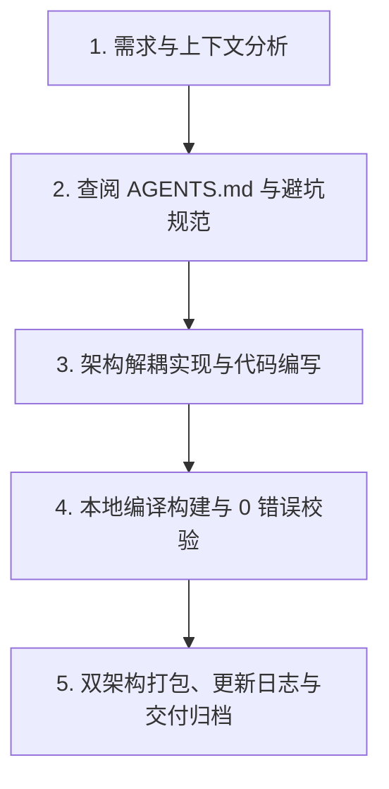

# StarPie (星盘) - 核心架构与多轮开发继承规范 (AGENTS.md)

> **致未来的 AI Agent 与开发者**：  
> 本文档是 **StarPie (原 WinPieGestures)** 项目的唯一权威工程架构与协作规范指南。当你在新的对话轮次或全新环境中接手本项目时，**必须首先通读本文档**，严格遵循本规范中所确立的架构分层、设计哲学、避坑指南与发布工作流，确保项目在持续迭代中保持高内聚、高品质、零退化与丝滑流畅。

---

## 目录
1. [🌟 项目起源、使命与设计哲学](#1-项目起源使命与设计哲学)
2. [🏗️ 源码架构与核心模块分工](#2-源码架构与核心模块分工)
3. [⚙️ 核心技术机制与避坑规范](#3-核心技术机制与避坑规范)
4. [🔄 代码生成、编译与发布流水线](#4-代码生成编译与发布流水线)
5. [🎨 UI/UX 与视觉设计规范](#5-uiux-与视觉设计规范)
6. [📜 版本里程碑演进图谱 (v1.0.0 ~ v1.7.0)](#6-版本里程碑演进图谱-v100--v170)
7. [🤝 Agent 接力协作与交付验收闭环](#7-agent-接力协作与交付验收闭环)

---

## 1. 🌟 项目起源、使命与设计哲学

### 1.1 灵感来源与初衷
- **创作者背景**：机械设计制造及其自动化专业学生，深度使用工业 CAD 软件 **SolidWorks**。
- **灵感核心**：SolidWorks 内置的**鼠标笔势手势轮盘 (Mouse Gestures Wheel)** 能在三维建模中带来行云流水般的盲操提效体验。本项目旨在将这种**工业级的高效轮盘交互迁移至 Windows 桌面全局**，使所有用户在日常办公、代码编写、设计创作与游戏多任务中，均能享受指尖翻飞的极速操作。
- **开源仓库**：GitHub `SoftBlack42/StarPie`。

### 1.2 产品三大工程红线 (Core Non-Negotiables)
1. **极致轻量 (Ultra-Lightweight)**：
   - 进程常驻后台静默运行，空闲内存占用必须严格控制在 **3MB ~ 8MB** 之间；
   - 杜绝引入重量级第三方 UI 库（如 Electron、MAUI、Heavy Chromium），纯基于原生 **.NET 8 WPF + Win32 P/Invoke API** 深度调优；
   - 绘图画刷、笔刷必须显式调用 `Freezable.Freeze()` 消除内存泄漏与 GC 抖动。
2. **零延迟与极致丝滑 (Zero Latency & 60/120 FPS Fluidity)**：
   - 鼠标右键/中键/侧键按下到轮盘完全呈现场景延迟必须 **< 16ms**；
   - 扇区高亮动画与光晕过渡采用贝塞尔平滑插值，杜绝卡顿与掉帧；
   - 钩子回调线程内绝不执行耗时 IO 或复杂计算，纯轻量位运算捕获。
3. **肌肉记忆与确定性 (Muscle Memory & Reliability)**：
   - 扇区角度与操作严格绑定空间极坐标方向（4 字键、8 字键、12 字键）；
   - 盲操触发命中率 100%，杜绝误触、漂移与错选。

---

## 2. 🏗️ 源码架构与核心模块分工

### 2.1 目录结构全景
```text
g:\Users\2 Better\Desktop\design\
├── WinPieGestures/                # 主工程源码目录 (.NET 8.0 WPF)
│   ├── WinPieGestures.csproj      # 项目配置文件 (版本号、依赖与打包参数)
│   ├── App.xaml / App.xaml.cs     # 应用宿主、单例互斥锁、Hook/托盘/设置窗口生命周期
│   ├── TrayController.cs          # 进程级系统托盘控制器（菜单、主题、UIPI 防护、提示与退出）
│   ├── RadialWindow.xaml(.cs)     # 核心悬浮轮盘窗口 (硬件加速透明渲染、高频动画)
│   ├── SettingsWindow.xaml(.cs)   # 按需创建的控制台主界面（配置面板、实时交互画布）
│   ├── SubActionEditorWindow.xaml(.cs) # 二级级联子动作独立编辑器
│   ├── HotkeyBuilderDialog.xaml(.cs)   # 快捷键拼装组合器 (自包含样式、一键预设芯片)
│   ├── ColorPickerWindow.xaml(.cs)     # 颜色选择器 (色盘选择、色相环与屏幕实时吸色)
│   ├── IconPickerWindow.xaml(.cs)      # 内置矢量 SVG / 图标提取器
│   ├── ProgramPickerWindow.xaml(.cs)   # 软件检索器 (模糊搜索、拼音索引、MRU缓存)
│   ├── InputDialog.xaml(.cs)      # 通用文本输入与配置重命名弹窗
│   ├── GestureController.cs       # 手势状态机 (拖拽位移、极坐标计算、命中测试)
│   ├── MouseHook.cs               # 低级鼠标全局钩子 (WH_MOUSE_LL)
│   ├── KeyboardHook.cs            # 低级键盘全局钩子 (WH_KEYBOARD_LL)
│   ├── ActionExecutor.cs          # 动作调度与 Win32 SendInput 模拟执行引擎
│   ├── ConfigManager.cs           # 配置序列化、持久化、导入/导出与注册表自启管理
│   ├── AppConfig.cs               # 全局配置数据模型 (主题、尺寸、动作、白名单等)
│   ├── WheelProfile.cs            # 单个轮盘方案数据模型 (扇区数、动作槽位列表)
│   ├── CustomColorPreset.cs       # 自定义配色方案模型
│   ├── AppThemeManager.cs         # 窗口深浅色主题画刷注入管理器
│   ├── FullScreenHelper.cs        # 独占全屏检测与 Windows Explorer 穿透识别
│   ├── ActiveWindowHelper.cs      # 前台活动窗口探测器
│   ├── MemoryOptimizer.cs         # 内存整理与工作集压缩工具
│   ├── I18n.cs                    # 多语言国际化字典 (zh-CN, zh-TW, en-US, ja-JP)
│   └── Renderers/                 # 轮盘切削形态渲染器策略族
│       ├── IRadialStyleRenderer.cs    # 渲染器通用抽象接口
│       ├── BaseStyleRenderer.cs       # 几何切削基础类
│       ├── StyleRendererFactory.cs    # 渲染器工厂
│       ├── ClassicRingRenderer.cs     # 经典圆弧与圆角胶囊渲染器
│       ├── CleanSectorsRenderer.cs    # 悬浮圆角矩形渲染器
│       └── GlassmorphismRenderer.cs   # 液态毛玻璃渲染器
├── releases/                      # 正式发行包构建归档目录
│   └── vX.Y.Z/
│       ├── Lightweight/           # 依赖运行时的轻量绿色包 (~2.5MB)
│       ├── Standalone/            # 独立单文件免安装自解压包 (~65MB)
│       ├── StarPie-vX.Y.Z-Lightweight-win-x64.zip
│       └── StarPie-vX.Y.Z-Standalone-win-x64.zip
├── attachments/                   # 文档与演示动图素材库 (GIF / PNG)
├── scratch/                       # 代码反编译基线与代码生成流水线工具
│   ├── Decompiler/                # Program.cs 流水线生成器工程
│   └── v152_decompiled/           # 反编译基线源码
├── AGENTS.md                      # 本架构与继承开发规范
└── CHANGELOG.md                   # 完整版本演进与发布日志
```

---

## 3. ⚙️ 核心技术机制与避坑规范

### 3.1 极坐标分区与扇区命中测试 (Hit-Testing)
- **极坐标基准**：
  $$\theta = \text{atan2}(\Delta y, \Delta x) \in [-\pi, \pi]$$
  角度 $0$ 为右侧，$\pi/2$ 为正下方（WPF 坐标系 Y 轴向下）。
- **一级轮盘与外圈子环 (Outer Sub-Ring)**：
  根据扇区数量 $N \in \{4, 8, 12\}$ 均匀划分扇区角度 $\Delta \theta = 2\pi / N$，扇区中心角 $\theta_i = -\pi/2 + i \cdot \Delta \theta$。
- **蜂窝扇 (Honeycomb Fan)**：
  - 二级菜单以被选中的主扇区为圆心展开（最多 3 项）；
  - **命中判定算法**：**严禁使用欧几里得圆心欧氏距离判定**！必须采用极坐标夹角绝对距离最近邻划分：
    $$\text{TargetIndex} = \arg\min_j |\text{NormalizeAngle}(\theta_{\text{mouse}} - \theta_j)|$$
    使得光标向左划动时必然命中左侧子叶，向右划动时必然命中右侧子叶，彻底杜绝判定左右颠倒的缺陷。

### 3.2 Win32 `SendInput` 模拟与硬件扫描码注入
- **硬件扫描码映射 (Scan Code)**：
  Windows 部分应用（如 Photoshop、Illustrator、3D CAD 等）直接监听底层硬件扫描码而非虚拟键码。下发按键时必须使用 Win32 `MapVirtualKey(vk, MAPVK_VK_TO_VSC)` 转换扫描码，并为方向键、Delete、Insert、PageUp/Down、Home/End、Win 等键打上 `KEYEVENTF_EXTENDEDKEY` 标志。
- **修饰键时延保持 (Modifier Hold Delay)**：
  下发 `Ctrl + G` 或 `Ctrl + Shift + G` 等组合键时，必须在修饰键按下和主键按下之间保留 **10ms ~ 15ms** 保持时延，并在主键释放后再释放修饰键，避免宿主应用因时序竞争丢失修饰键而误判为单键 `G`。
- **连续数值与文本注入**：
  遇到多位数值（如 `"100"`、`"1920"`）或字符串时，采用 `KEYEVENTF_UNICODE` 字符流逐字符发送，完美规避输入法阻断。

### 3.3 快捷键录制框 (`HotkeyRecorderBox`) 焦点规范
- **禁止 WPF 默认焦点跳转**：
  `Tab` 是 WPF 系统的焦点切换键。在 `HotkeyRecorderBox` 控件中必须在构造函数中执行：
  ```csharp
  KeyboardNavigation.SetTabNavigation(this, KeyboardNavigationMode.None);
  KeyboardNavigation.SetDirectionalNavigation(this, KeyboardNavigationMode.None);
  KeyboardNavigation.SetControlTabNavigation(this, KeyboardNavigationMode.None);
  ```
  确保按下 `Tab`、`Alt + Tab`、`Win + Tab` 时控件不丢失焦点，并能在 `OnPreviewKeyDown` 中拦截 `Key.Tab` / `Key.System` 顺利完成组合录制。

### 3.4 场景隔离、全屏检测与白名单穿透
- **Windows Explorer 进程穿透**：
  桌面窗口（`Progman`、`WorkerW`、`SHELLDLL_DefView`、`SysListView32`）与任务栏（`Shell_TrayWnd`、`Shell_SecondaryTrayWnd`）在全屏检测中必须显式穿透，不得被判定为全屏独占应用。
- **白名单优先级**：
  在「全屏游戏/独占应用自动禁用手势」开启时，位于 `WhitelistedProcesses` 白名单中的程序（如 Photoshop、CAD、Visual Studio 等）具有**最高旁路优先级**，无论是否全屏独占均能呼出轮盘。

### 3.5 配置持久化与自定义配色无损导入/导出
- **数据完整性**：
  `ConfigManager.ExportConfig` 必须将全局 `CustomColorPresets` 列表连同当前主题选择、微调色彩参数、几何尺寸全部导出至 JSON。
- **导入即时刷新**：
  `ImportConfigButton_Click` 导入成功后，必须立即调用：
  ```csharp
  ReloadThemePresets(); // 重构一二级主题下拉列表
  RefreshSlots();       // 刷新动作列表绑定
  RenderLiveWheelPreview(); // 刷新实时交互画布
  ```
  杜绝由于 `_isUpdatingUi` 状态锁导致界面控件脱节的问题。

### 3.6 应用宿主、托盘与设置窗口生命周期
- **进程级所有权**：`App` 是程序宿主，负责持有 `MouseHook`、`KeyboardHook`、`GestureController`、`TrayController`，并通过 `ShowSettingsWindow(int tabIndex = -1)` 统一管理 `SettingsWindow` 的创建与显示。
- **托盘必须独立于设置窗口**：
  - `NotifyIcon`、托盘菜单、暂停/恢复、主题、本地化、提权、退出和提示气泡统一由 `TrayController` 管理；
  - 管理员权限运行时的 `ChangeWindowMessageFilter` / `ChangeWindowMessageFilterEx` UIPI 消息放行必须保留在 `TrayController`；
  - 严禁重新把托盘生命周期放回 `SettingsWindow`，否则静默启动会再次加载完整控制台 UI。
- **设置窗口按需创建**：
  - 静默启动、开机自启时严禁直接 `new SettingsWindow()`；
  - 普通启动、托盘菜单、第二实例唤醒，以及轮盘动作「打开 StarPie 控制台」都必须调用 `App.ShowSettingsWindow()`；
  - 严禁使用 `App.MainSettingsWindow?.ShowSettings()` 作为入口，因为窗口释放后该调用会静默失效。
- **30 秒延迟释放策略**：
  - 用户关闭控制台时先 `Hide()` 并启动 30 秒一次性计时器；
  - 30 秒内重新打开时取消计时器并复用原窗口；
  - 空闲超过 30 秒后才真正 `Close()`，解除外部事件、停止计时器、取消下载/更新任务并释放 ViewModel；
  - 最终释放后只允许调用 `MemoryOptimizer.TrimMemory(force: false)`，不得在日常关闭路径执行 Full GC 与强制工作集剥离，避免下一次轮盘唤起发生硬缺页或卡顿。
- **初始化不得产生系统副作用**：WPF 给 `CheckBox.IsChecked` 赋值时也可能触发 `Checked/Unchecked`。加载自启动状态时必须同时使用 `_isUpdatingUi`、`_isUiInitializing` 与 `_isLoadingAutoStartState` 防护，并比较已加载状态；只有用户实际修改开关时才能调用 `ConfigManager.SetAutoStart()`，严禁打开控制台时创建或删除计划任务。
- **显式退出模式**：`App.xaml` 必须保持 `ShutdownMode="OnExplicitShutdown"`，关闭最后一个设置窗口不能结束后台 Hook 与托盘进程；只有托盘退出、提权重启或明确的应用退出流程可以调用 `Shutdown()`。

---

## 4. 🔄 代码生成、编译与发布流水线

### 4.1 代码构建与修改原则
- **优先直接维护 `WinPieGestures/` 源码**：项目源码已完整解耦，可以直接在 `WinPieGestures` 中进行修改、扩展与调试。
- **流水线工具 `scratch/Decompiler/Program.cs`**：当需要批量从基线生成或大范围重构时，同步维护 `Program.cs` 并通过 `dotnet run --project scratch/Decompiler` 生成源码。

### 4.2 标准构建与发布命令集
```powershell
# 1. 编译 Release 版本并校验 0 错误
dotnet build "g:\Users\2 Better\Desktop\design\WinPieGestures" -c Release

# 2. 发布轻量版 (Lightweight, 需本地 .NET 8 运行时, 体积 ~2.5MB)
dotnet publish "g:\Users\2 Better\Desktop\design\WinPieGestures" -c Release -r win-x64 --no-self-contained -o "g:\Users\2 Better\Desktop\design\releases\vX.Y.Z\Lightweight"

# 3. 发布独立免安装版 (Standalone, 自带运行时, 单文件绿色版, 体积 ~65MB)
dotnet publish "g:\Users\2 Better\Desktop\design\WinPieGestures" -c Release -r win-x64 --self-contained true -p:PublishSingleFile=true -p:IncludeNativeLibrariesForSelfExtract=true -o "g:\Users\2 Better\Desktop\design\releases\vX.Y.Z\Standalone"

# 4. 自动化打包生成 ZIP 压缩归档
powershell -Command "Compress-Archive -Path 'g:\Users\2 Better\Desktop\design\releases\vX.Y.Z\Lightweight\*' -DestinationPath 'g:\Users\2 Better\Desktop\design\releases\vX.Y.Z\StarPie-vX.Y.Z-Lightweight-win-x64.zip' -Force; Compress-Archive -Path 'g:\Users\2 Better\Desktop\design\releases\vX.Y.Z\Standalone\*' -DestinationPath 'g:\Users\2 Better\Desktop\design\releases\vX.Y.Z\StarPie-vX.Y.Z-Standalone-win-x64.zip' -Force"
```

### 4.3 版本号同步五要素检查清单 (Version Sync Checklist)
每次发布新版本 `vX.Y.Z` 时，必须同步更新以下 5 处位置：
1. `WinPieGestures.csproj`：`<Version>X.Y.Z</Version>`, `<AssemblyVersion>X.Y.Z.0</AssemblyVersion>`, `<FileVersion>X.Y.Z.0</FileVersion>`
2. `App.xaml.cs`：启动日志中的 `StarPie vX.Y.Z` 回退文本
3. `SettingsWindow.xaml(.cs)`：左侧边栏、关于卡片、更新页与 User-Agent 中的版本回退文本和里程碑
4. `TrayController.cs`：托盘右键菜单标题的 `StarPie vX.Y.Z` 回退文本
5. `CHANGELOG.md`：在顶部添加规范的 `## [vX.Y.Z] - YYYY-MM-DD` 详细变更日志

---

## 5. 🎨 UI/UX 与视觉设计规范

### 5.1 界面布局与卡片规范 (Settings Console)
- **四标签页导航**：
  1. 🎨 **外观与形态**：主轮盘/二级轮盘尺寸、内径、外径、倒角、图标大小、文字字号、切削形态（经典圆弧、圆角胶囊、极简扇区、蜂巢六边形）、主题与自定义配色面板；
  2. ⚡ **手势与动作**：触发按键（右键/中键/侧键）、多级轮盘总开关、二级菜单展示样式（外圈子环 / 蜂窝扇）、动作映射列表（支持 `[ ⚙️ 拼装 ]` 与直接录入）；
  3. 🛡️ **触发与场景**：黑白名单切换、全屏独占检测、手势容差距离、外甩脱离取消开关与灵敏度；
  4. ⚙️ **高级与系统**：开机静默自启、语言切换（四语系）、配置导入/导出备份、版本里程碑。
- **实时交互画布 (Live Preview)**：
  - 位于主界面右侧常驻，支持鼠标悬停、扇区高亮动画即时反馈；
  - 顶部配备 `[ 🔘 一级主轮盘配置    🌟 二级级联轮盘配置 ]` 分段切换开关，左侧尺寸与配色面板随之联动。

### 5.2 深色模式高对比度规范
- 在极夜曜黑（`ObsidianDark`）与钛金深灰（`TitaniumGray`）主题下：
  - 标题、常规文本与开关控件文字的前景颜色必须严格绑定为高亮度白色（`#F8FAFC` / `#FFFFFF`）；
  - 严禁出现与背景色（`#0F172A` / `#18181B`）对比度低于 4.5:1 的灰暗文字。

### 5.3 对话框与子窗口自包含规范
- 所有弹窗（如 `HotkeyBuilderDialog`、`InputDialog`、`ColorPickerWindow`）：
  - 必须在 `<Window.Resources>` 内置完整的自包含按钮与控件样式；
  - 必须在构造函数中调用 `AppThemeManager.ApplyTheme(this, ConfigManager.CurrentConfig?.AppTheme ?? "System")`，跟随主程序主题。

---

### 6. 📜 版本里程碑演进图谱 (v1.0.0 ~ v1.7.0)

| 版本 | 发布日期 | 核心突破与重要变更 |
| :--- | :--- | :--- |
| **v1.0.0 ~ v1.2.5** | 2026-08 | 诞生与基础架构：4/8/12 扇区支持、原生 WPF 轮盘渲染、深浅色主题、基础动作绑定、CollectUI 风格设置控制台 |
| **v1.3.0 ~ v1.3.8** | 2026-08-23 | 形态与国际化飞跃：液态毛玻璃渲染器、5 种切削形态、Shell 原生高清图标提取、四语系国际化支持、轻量/独立双打包规范 |
| **v1.3.9 ~ v1.4.2** | 2026-08-25 | 交互深化：打开文件夹动作、外甩脱离取消 (Outer Escape)、单例防多开 Mutex、实时配色同步 |
| **v1.4.3 ~ v1.4.5** | 2026-08-28 | 硬件引擎升级：物理多键录制捕获器、三档动效调速、多级轮盘与级联子菜单 (外圈同心子环)、进程黑白名单隔离 |
| **v1.5.0 ~ v1.5.2** | 2026-08-30 | 体验调优：交互画布一二级分段切换、独立二级光晕、拼音+编辑距离模糊应用检索、蜂巢六边形倒角修复 |
| **v1.5.3 ~ v1.5.5** | 2026-08-31 | 蜂窝扇与按键引擎：新增「蜂窝扇」二级形态、极坐标角距扇区判定、Win32 硬件扫描码映射、快捷键拼装预设芯片与全量配色备份 |
| **v1.5.6 ~ v1.5.7** | 2026-09-01 | 排序与调度革命：运行命令多终端支持、轮盘动作 ▲/▼ 调序、扇区方位微缩指示器、独立鼠标钩子后台线程与高频手势调度合并 |
| **v1.5.8** | 2026-09-01 | 兼容与诊断：Win10 计算器双通道唤起修复、PrintScreen 独立截屏热键支持、启动 Explorer 修复、异步系统运行日志与一键诊断面板 |
| **v1.6.0** | 2026-09-02 | 交互与个性化飞跃：侧边栏默认极简折叠开阔界面、单个扇区独立排版定制覆盖（模式/字号/字体/文字颜色/图标大小）、画布点击选中联动、中心文字与扇区文字属性彻底解耦 |
| **v1.6.1** | 2026-09-03 | 动作区双栏重构与拖拽直觉交互：手势动作区双栏画布+聚焦卡片重构、轮盘画布直接拖拽对调功能位置、中心核圆死区触发与超紧凑预设横幅、打开网址 WebUrl 多浏览器指定调度、方案一键复制与当前进程捕捉 |
| **v1.6.2** | 2026-09-03 | 视觉美化与细节修复：手势动作区实时画布纯图标无文字极简渲染对齐外观形态预览、Windows 注册表 App Paths 多盘符浏览器绝对路径解析与 Edge 协议直达、画布 Preview 隧道事件拖拽对调打通与平滑状态反馈、严格遵循中心核圆启用开关、唤起控制台记忆上次 Tab 活动状态 |
| **v1.6.5** | 2026-09-03 | 外甩取消重塑与二级拖拽：外甩取消动作配置卡片全新重塑（7大精简分类+7大窗口管理子模式+三合一程序拾取）、6大外甩高频极速预设芯片、二级子动作拖拽对调修复、一二级拖拽链接开闭开关 |
| **v1.6.6** | 2026-09-03 | 原生 OCR 与架构解耦升级：Windows 10/11 原生 WinRT 离线 OCR 引擎与多模态 AI 接口支持、动作执行与图标来源彻底解耦、Shell 降权启动解决 UIPI 拖放失效、打开文件夹支持系统虚拟路径 |
| **v1.6.7** | 2026-09-03 | 综合优化迭代：原生 OCR 流生命周期与语言包环境诊断修复、ScreenHelper 统管 PerMonitorV2 与渲染帧二次物理校准解决多屏唤起漂仪、多级轮盘卡片迁入 Tab 3、新增核心圆唤醒死区灵敏度滑块、二级轮盘外观预览单扇区聚焦消除遮挡 |
| **v1.6.8** | 2026-09-04 | 视觉品牌、交互大成、热键可靠性与开机秒启：全新星盘宇宙公转轨道与四芒星核超清图标 (cover.v3)、Windows 开机自启速度深度重构 (计划任务零延迟/异步延迟自愈/控制台懒加载/开机冷启暴降至30~60ms/静默内存压至<1MB)、热键粘滞与按键失灵根治 (VK_SNAPSHOT扫描码修复/双通道成对释放/三阶异步守护/低级钩子自愈盾)、动作配置画布经典形态固化统一消除异形干扰、GitHub加速源新增 (github.akams.cn)、方案管理工具栏与折叠下拉栏同步重构、蜂窝扇二级轮盘方位颠倒修复、控制台一二级配置模式双向联动与实时预览保持、轮盘扇区自适应弹性字号 (Auto Font-Fit)、语言选单微标规范化、视口呼吸留白与高对比度滑块、全量多语言覆盖、画布缩放修复、快捷键Pause与搜索、独占暂停全局热键、侧边栏主题切换、贡献者致谢离线策略、平铺设置折叠、深色对比度优化、扇区文字位置与微调、屏幕边缘防溢出 |
| **v1.6.9** | 2026-09-06 | 简单/高级双模体系与持久化守卫 & 扇区重置根治与容量匹配 & 配置布局切换锁死修复：简单模式与高级全量模式双模极速切换与按图保留定制、彻底根除重启后扇区动作重置为平铺左右对半缺陷与全自动数据自愈、程序图标继承渲染优先级提升与平铺子模式覆写保护、开机秒启懒加载与退出配置无损持久化守卫彻底根除防误触被关闭、六大画布与轮盘渲染通路图标继承逻辑全面对齐、动作聚焦编辑卡片增加关联图标徽标与预览、二级菜单蜂窝扇(最多3项)与外圈子环(最多4项)说明描述与添加/渲染动态容量全闭环匹配、根除 _uiUpdateDepth 引用计数锁死缺陷彻底解决配置布局与模式切换失灵 |
| **v1.7.0** | 2026-09-06 | 简单模式层级精简提纯 & 侧边栏微标重塑 & 中心核圆动作图标呼出修复 & 高级模式多层无限轮盘 & 控制台生命周期解耦：鼠标手势卡片、顺势外甩执行动作高级区、屏幕边缘防溢出卡片与紧凑全览列表分段切换器全面纳入高级模式；简单模式锁定极简画布精调；重构侧边栏模式微标折叠态居中胶囊与点击一键切模；呼出轮盘后滚轮/Tab键无级循环切换多层无限轮盘，每层独立扇区数/动作/核圆配置；彻底修复真机呼出轮盘 (RadialWindow) 中心核圆配置动作图标不显示的缺陷，打通 SVG、外部程序图标与自定义图标包全链路渲染通路并支持琥珀光晕高亮；新增独立 `TrayController`，静默启动不再创建 `SettingsWindow`，控制台关闭后采用 30 秒复用窗口与轻量延迟释放策略，并修复初始化误触发计划任务和窗口释放后轮盘控制台动作失效问题。 |

---

## 7. 🤝 Agent 接力协作与交付验收闭环

当新的 AI Agent 会话开始时，请务必执行以下**五步交付闭环**：



1. **需求理解与方案规划**：确认修改范围，严防破坏既有轮盘手感、内存优化与场景隔离逻辑；
2. **规范核对**：检查样式是否自包含、快捷键是否支持扫描码、命中判定是否使用极坐标、文字对比度是否达标；
3. **精准编码**：修改对应模块，保持命名规范与注释完整性；
4. **编译与验证**：执行 `dotnet build WinPieGestures -c Release` 确保 **0 错误**；
5. **打包与日志归档**：
   - 运行轻量版与独立版发布命令；
   - 生成 `StarPie-vX.Y.Z-Lightweight-win-x64.zip` 与 `StarPie-vX.Y.Z-Standalone-win-x64.zip`；
   - 更新 `CHANGELOG.md` 与 `WinPieGestures.csproj` 版本号。

---
*StarPie 致力于将工业级的极速手感带给每一位创作者。遵循本规范，共同打造最纯粹、极致的 Windows 轮盘工具！*
